

<!-- class: lead invert -->

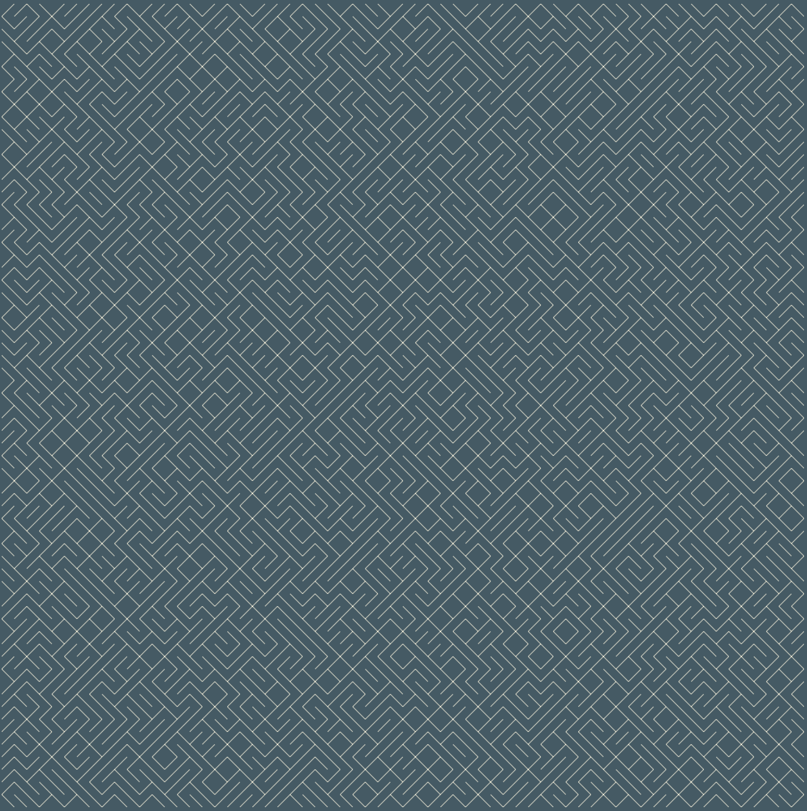

# The Joy of Programming
## Anand Chitipothu
### _PyConf Hyderabad 2020_
---
<!-- class: lead  -->

# Hello!

<!-- class: intro  -->

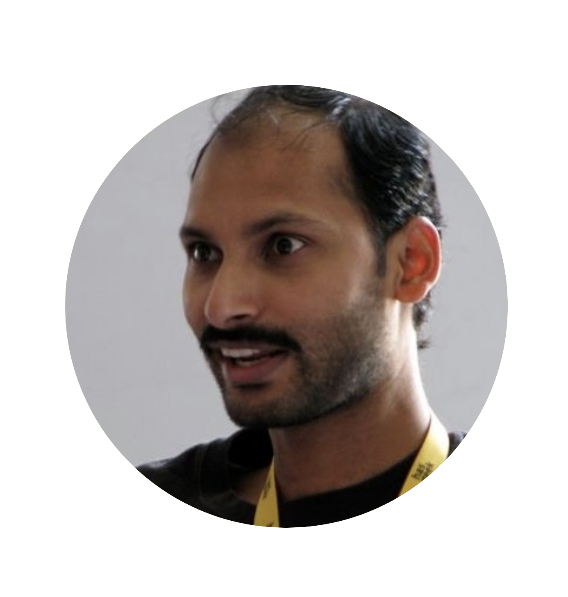

I'm Anand Chitipothu.

Crafting beautiful software since two decades.

Built web.py, Infogami, and
Open Library.

Trained hundreds of engineers.

Tried a startup and failed.

---

<!-- class: lead invert -->

# Fundamental Ideas of Programming

---

<!-- class: lead -->

# Challenge #1

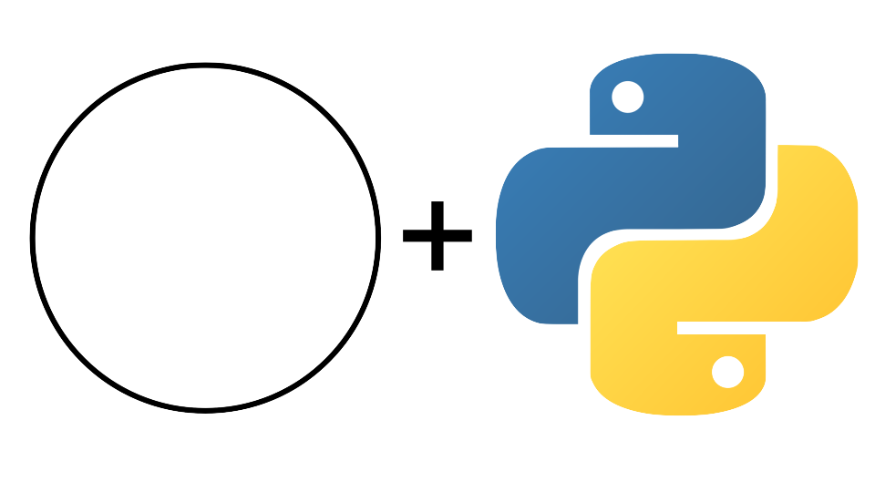

---

<!-- class: lead -->

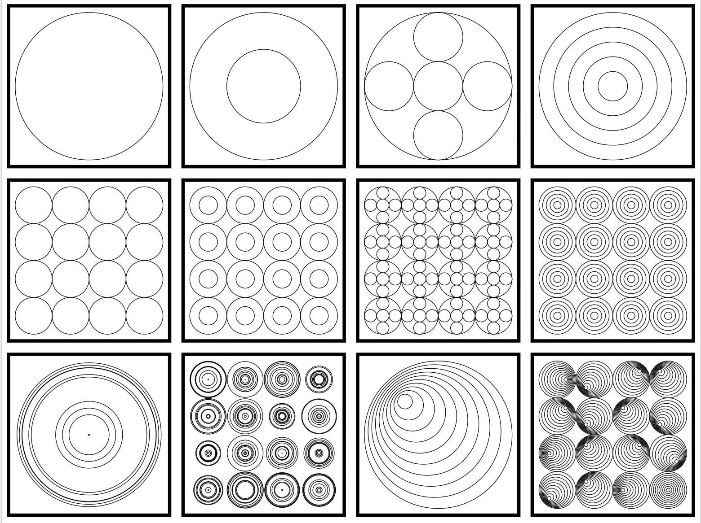

---

# Challenge #2

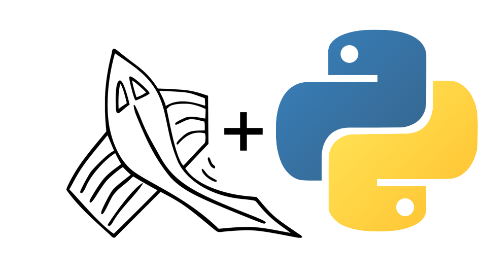

---

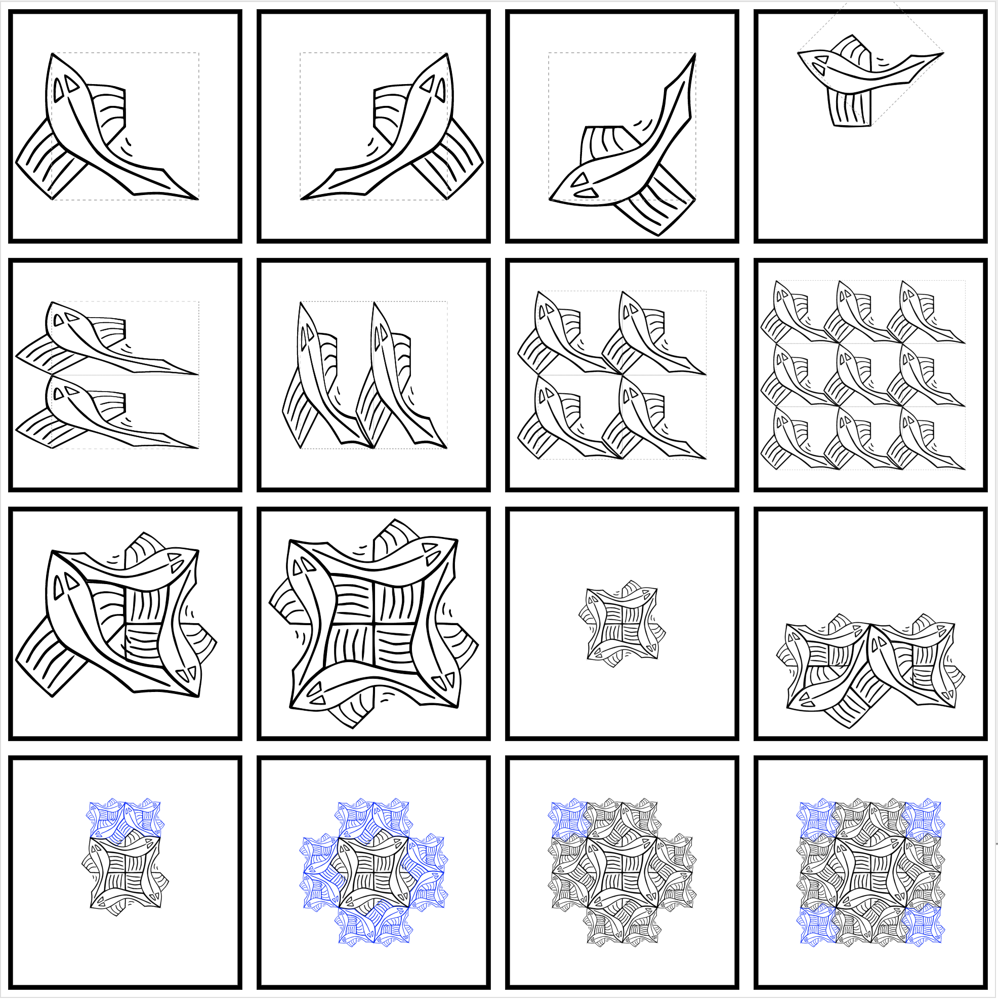

---

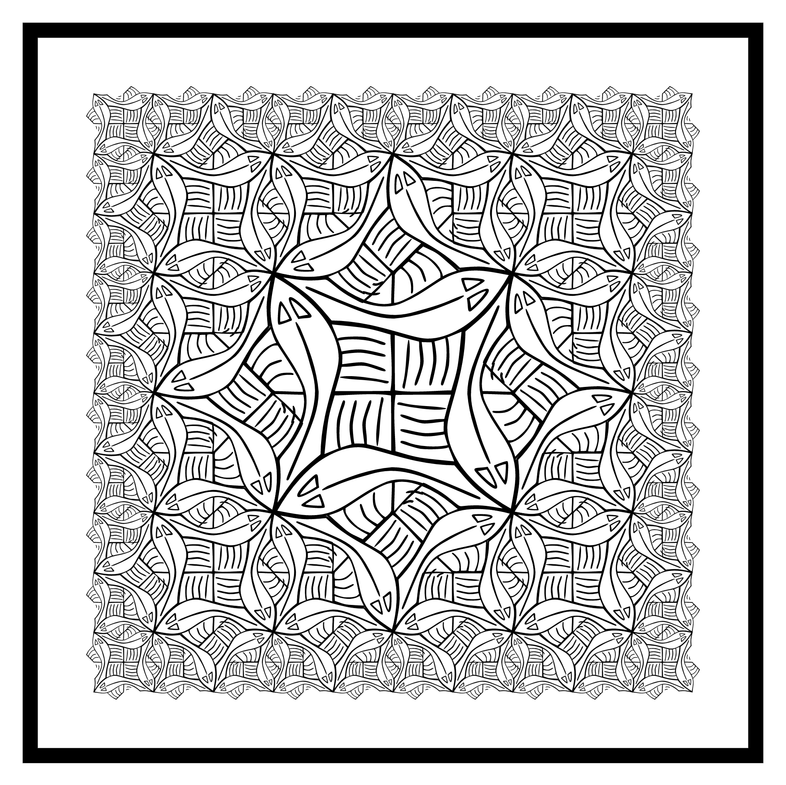

---

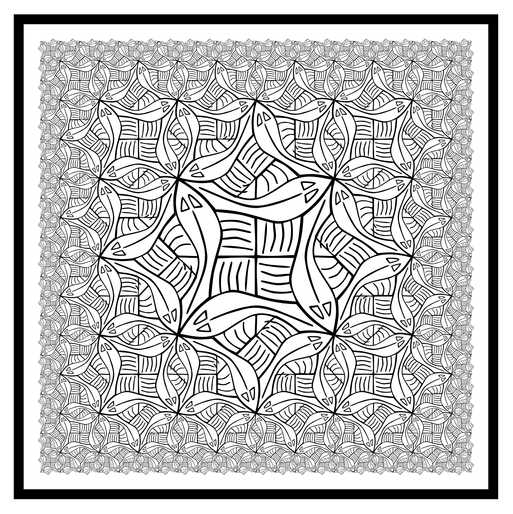

---

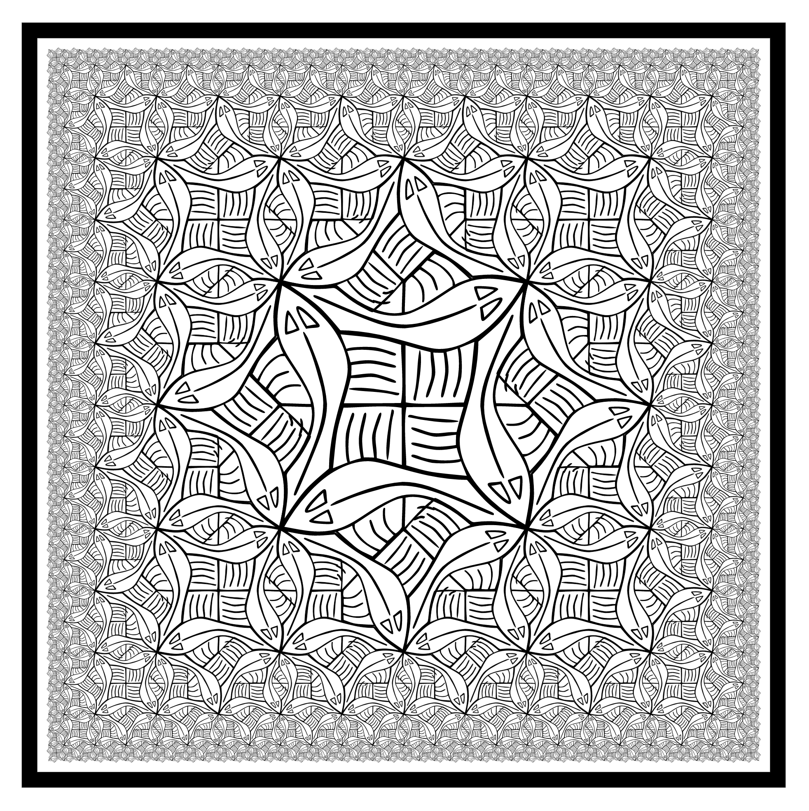

---
## M. C. Escher

### _Square Limit_, 1964
#### &copy; M.C. Escher; Fair Use

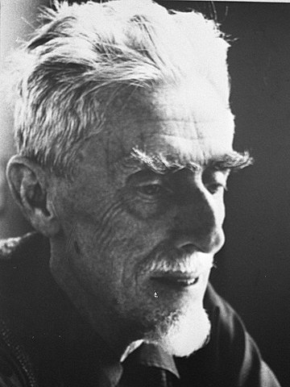

---

**Functional Geometry**
_Peter Henderson_
1982

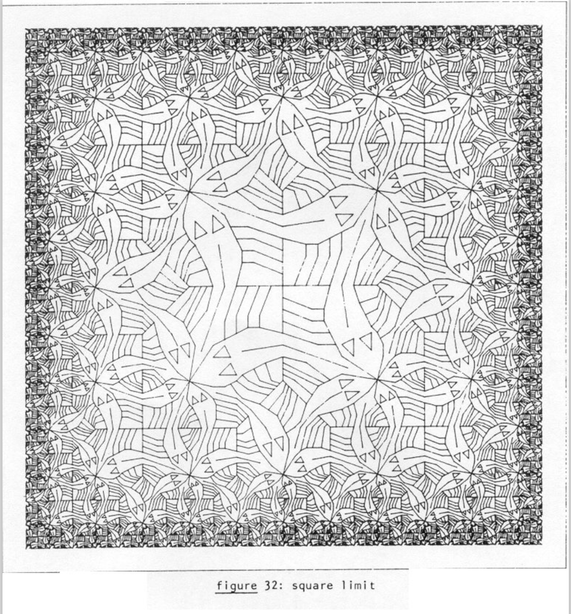

---
**Functional Geometry**
_Peter Henderson_
2002

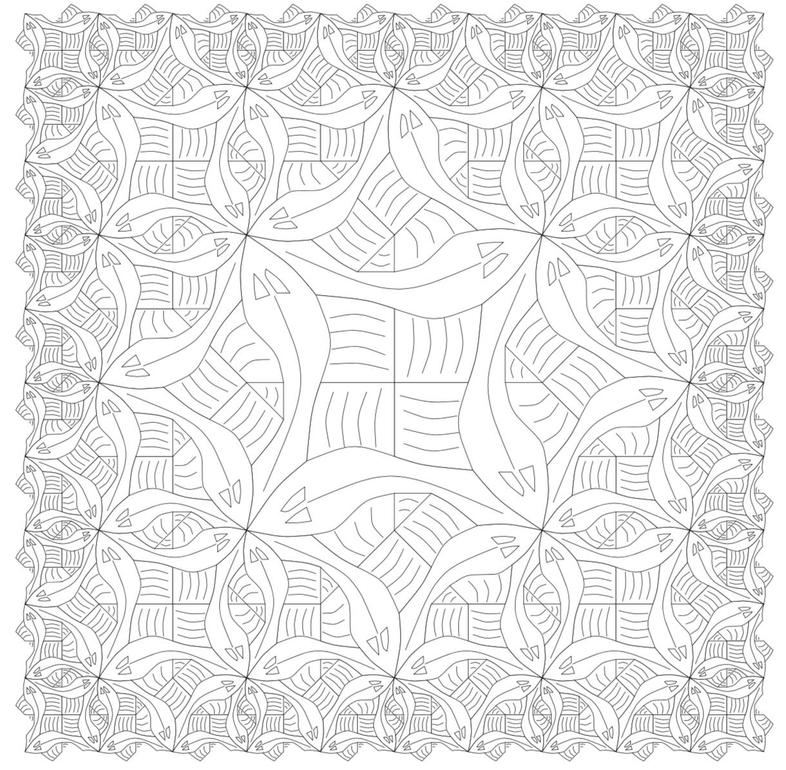

---

---

# Challenge for You!

---

# Summary

- Composing simple ideas

---

# References

* [Functional Geometry - Peter Henderson][funcgeo2]
* [Functional Geometry (in Julia) - Shashi Gowda][shashi]
* [Structure and Interpretation of Computer Programs (The Wizard Book)][sicp]
* [Gödel, Escher, Bach: an Eternal Golden Braid - Douglas Hofstadter][geb]
* [M. C. Escher -- Wikipedia](https://en.wikipedia.org/wiki/M._C._Escher)

[sicp]: https://mitpress.mit.edu/sites/default/files/sicp/full-text/book/book.html
[geb]: https://en.wikipedia.org/wiki/G%C3%B6del,_Escher,_Bach
[shashi]: http://shashi.biz/ijulia-notebooks/funcgeo/
[funcgeo2]: https://eprints.soton.ac.uk/257577/1/funcgeo2.pdf

---

# Credits

- The Fish image - Shashi Gowda

---

## Thanks!

Anand Chitipothu
@anandology

https://github.com/anandology/the-joy-of-programming